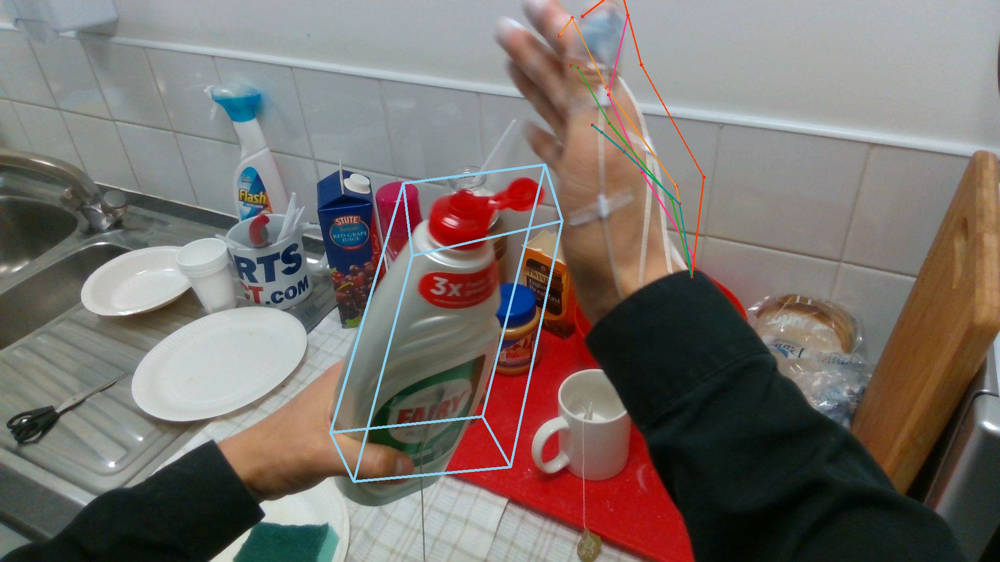
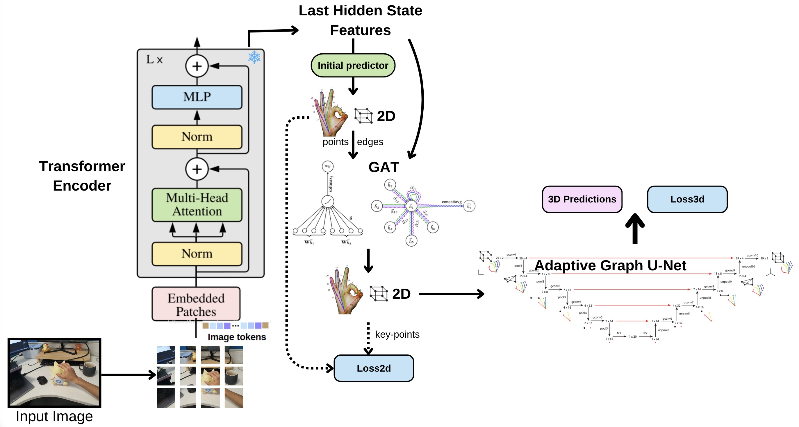
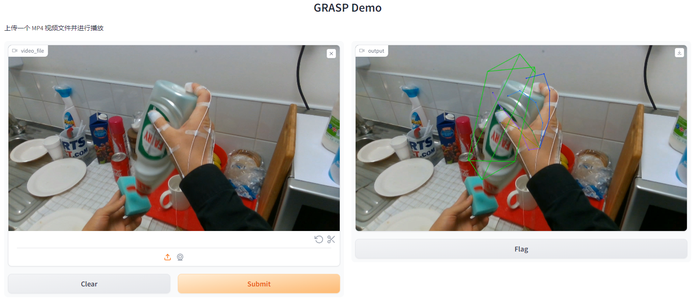

# A Graph-based Attention System for Hand-Object Pose Estimation (GRASP)

The goal of GRASP is to jointly estimate the poses of both the hand and a handled object. Our GRASP model can estimate the 2D and 3D hand and object poses given a single image or video.

<div align="center">
    
</div>

Our model comprises three stages. First, we leverage the pre-trained vision transformer encoder to extract features from the input image. Then, we pass the features through a fully connected initial predictor to obtain initial 2D key-points, which are fed into the Graph Attention Network along with the features and connected edges of joints and the bounding box to achieve better estimation outputs. Finally, the 2D coordinates predicted in the previous step are passed to Adaptive Graph U-Net(similar to HOPE-Net [2]) to estimate the 3D coordinates of the hand and object.

<div align="center">
    
</div>

## Datasets

To use the datasets, download [**First-Person Hand Action Dataset**](https://guiggh.github.io/publications/first-person-hands/) and update the root path in the `make_data.py` file located in each folder and run the `make_data.py` files to generate the `.npy` files.

## Train Model

First download [**First-Person Hand Action Dataset**](https://guiggh.github.io/publications/first-person-hands/) and make the `.npy` files. Then download and train the model with the command below.

```
wget http://vision.soic.indiana.edu/wp/wp-content/uploads/graphunet.tar.gz
tar -xvf graphunet.tar.gz

python HOPE.py --input_file ./datanpy/ --output_file "OUTPUT_MODEL_PATH" --train --val --model_def hopenetmodify
```

Besides, you can set hyperparameter with arguments below

```
--batch_size 
--gpu 
--gpu_number
--learning_rate
--lr_step
--lr_step_gamma
--log_batch
--val_epoch
--snapshot_epoch
--num_iterations
```


An example: </br>
``` python HOPE.py --input_file ./datanpy/ --output_file ./checkpoints/hopemodify/model-hopemodify- --train --val --resume ./checkpoints/hopemodify/model-hopemodify-2880.pkl --batch_size 50 --model_def hopenetmodify --gpu --gpu_number 0 1 2 3 --learning_rate 0.001 --lr_step 100 --lr_step_gamma 0.9 --log_batch 20 --val_epoch 2000 --snapshot_epoch 20 --num_iterations 5000 > train_hopemodify.log 2>&1 ```

## Test Pretrained Model

First download [**First-Person Hand Action Dataset**](https://guiggh.github.io/publications/first-person-hands/) and make the `.npy` files. Then download and extract the pretrained model with the command below and then run the model using the pretrained weights. Meanwhile you can check visualization result in folder 'output'

```
wget http://vision.soic.indiana.edu/wp/wp-content/uploads/graphunet.tar.gz
tar -xvf graphunet.tar.gz

python single_img.py --input_file “IMAGE_FOLDER_PATH” --test --model_def hopenetmodify --gpu --gpu_number 0 --pretrained_model "MODEL_PATH"
```

## Run our application

To use our application, run code below

```
python main.py --model_def hopenetmodify
```

You must choose your gpu and model with arguments below

```
--gpu
--gpu_number
--pretrained_model
```

You can upload your own video on the left, then GRASP will visualize the information on the right

<div align="center">
    
</div>

## Acknowledgement

Thanks to Hand-Object Pose Estimation (HOPE)[**HOPE-Net paper**](https://arxiv.org/pdf/2004.00060.pdf) (CVPR 2020)
